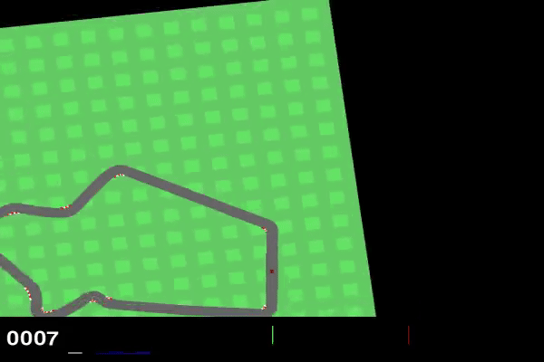
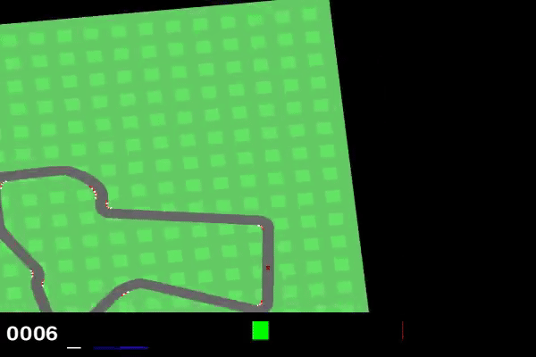

# Solving Gymnasium's Car Racing with Reinforcement Learning

This project compares three reinforcement learning algorithms on [Gymnasium's CarRacing-v3](https://gymnasium.farama.org/environments/box2d/car_racing/) environment: **DQN**, **PPO**, and **SAC**. Each algorithm is implemented in a standalone Colab notebook using [Stable Baselines3](https://stable-baselines3.readthedocs.io/).

## Deep Q-Network (DQN)



## Proximal Policy Optimization (PPO)


## Soft Actor-Critic (SAC)



## Results

Hardware: Google Colab L4

| Model Type | Discrete | Average Reward | Training Time | Total Training Steps | HuggingFace                                        |
|------------|----------|----------------|---------------|----------------------|----------------------------------------------------|
| DQN        | Yes      | 897.77         | 5:41:22       | 750,000              | [Link](https://huggingface.co/kuds/car-racing-dqn) |
| PPO        | No       | 887.84         | 5:33:03       | 751,614              | [Link](https://huggingface.co/kuds/car-racing-ppo) |
| SAC        | No       | 787.69         | 6:29:16       | 750,000              | [Link](https://huggingface.co/kuds/car-racing-sac) |

## Getting Started

### Prerequisites

- Python 3.10+
- CUDA-capable GPU (recommended)

### Installation

```bash
pip install -r requirements.txt
```

Alternatively, open any notebook directly in Google Colab using the badge at the top of each notebook.

## Training Notes

- Set `ent_coef` for PPO as it encourages exploration of other actions. Stable Baselines3 defaults the value to 0.0. [More Information](https://www.youtube.com/watch?v=1ppslywmIPs)
- Do not set your `eval_freq` too low, as it can sometimes cause instability during learning due to being interrupted by evaluation (e.g. >= 10,000).
- `buffer_size` defaults to 1,000,000, which requires significant memory for DQN and SAC. Try setting it to a more practical value when using the original observation space (e.g., 200,000).
- Set the `gray_scale` flag in the notebooks to `True` to allow DQN and SAC to run without using the High-RAM option in Google Colab (buffer size <= 150,000). This converts the observation space from (96 x 96 x 3) images to (84 x 84) grayscale images.

## Blog Posts

- [Solving Gymnasium's Car Racing with Reinforcement Learning](https://www.findingtheta.com/blog/solving-gymnasiums-car-racing-with-reinforcement-learning)
